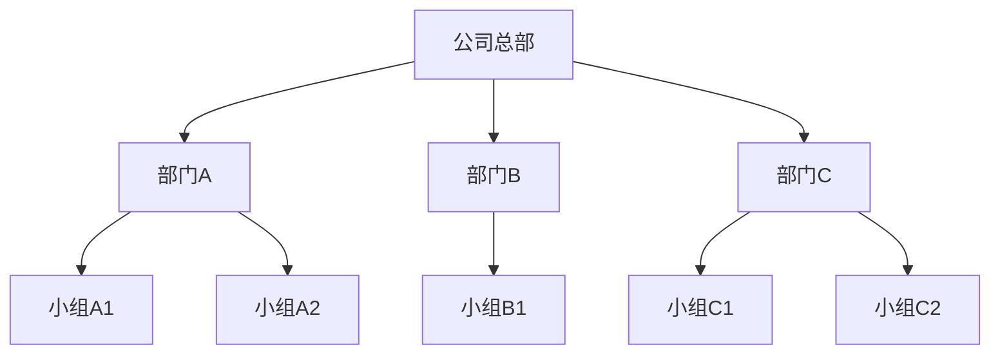

# Mermaid 组织架构图速查手册

在 Obsidian 中使用 Mermaid 绘制**组织部门关系图**的快速参考。

> [!tip] 提示
> 确保已启用**核心插件中的“图表”**，并在代码块中使用 ````mermaid```` 语言标识。

## 基础模板



## 语法说明

|元素|说明|
|---|---|
|`graph TD`|自上而下绘制（Top Down），适合组织架构|
|`节点名[显示文字]`|定义一个矩形节点（如 `HR[人力资源部]`）|
|`父节点 --> 子节点`|表示隶属/管理关系|
|中文节点名|可直接使用中文，无需引号|

- 推荐写法：显式命名+显示分离

## 常见问题

- 图表不渲染：检查是否启用了“图表”插件，并确认代码块以 ````mermaid 开头。
- 想换方向：改用 `graph LR`（从左到右），但组织架构通常用 `TD` 更清晰。建议只在项目过多导致横向显示困难时使用。
- 图标或颜色：可通过 Mermaid 样式扩展（需 CSS 片段支持），基础用法无需复杂样式。