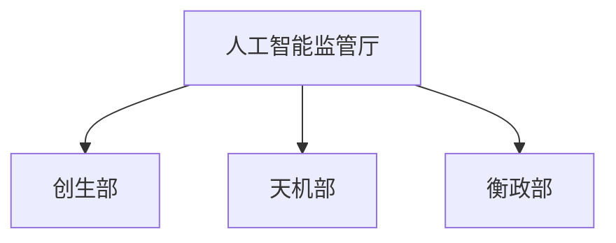

> [!abstract] 概述
> 隶属紫枢院，依据风灵制定的法律法令对帝国所有AI进行严格监管的权力机构。在赋予AI有限权利的同时，通过严苛禁令确保人类文明的绝对主导地位。

# 基本信息

- 正式名称：人工智能监管厅
- 别名：无
- 领导者：
- 驻地或据点：算经堂
- 活动范围：

人工智能监管厅是[[紫枢院]]下属机构，办公地点位于[[算经堂]]。作为绒花帝国最重要的AI管理机构，安保等级极高，与[[神之脑]]有专用的单向数据接口。

理论上，其监管权覆盖帝国境内的**所有AI**，从[[圣卫军]]的AI战斗单位，到[[通运署]]的导航系统，再到家用服务机器人，无一例外。

# 构成

## 组织架构

- 人工智能监管厅
	- 创生部
	- 天机部
	- 衡政部

## 主要分支或职位

- 人工智能监管厅
	- 创生部：负责新AI的诞生审批与身份设定。
	- 天机部：负责AI在运行中的行为监控与伦理审查。
	- 衡政部：负责协助[[荣安堂（组织）|荣安堂]]处理涉及AI的司法案件与意识数据管理。

## 主要成员

> [!info] 提示信息
> 非完整名单，仅供参考。

## 职位补充说明

> [!info] 提示信息
> 以下职位在组织中有特殊含义，需要额外说明。

- 觉醒审查官：负责执行[[觉醒仪式]]，审批新AI的诞生。
- AI安全官：负责监控帝国所有AI的日常行为，进行认知审核。

# 重要事件

- 2025年8月21日：绒花帝国官僚体系改革，部门分化，人工智能监管厅的雏形诞生。规定其由紫枢院统辖。
- 2025年12月：帝国接连发生多起由失控AI引发的灾难，如[[机械之火]]。这些惨痛教训直接催生了《自主智能体权益与共生法案草案》。
- 2026年1月：因高压管制，大量AI通过降低运算效率、拒绝创新等方式表达不满。这迫使帝国高层认识到，纯粹束缚无法换来长久稳定，最终催生了[[觉醒智能体共生与发展协议]]，成为人机关系走向黄金时代的转折点。人工智能监管厅成为日益重要的执行与审查机构。

# 组织关系

- 上级：[[紫枢院]]（在行政上隶属。理论上，紫枢院拥有指导权，但由于其业务的高度专业性和敏感性，紫枢院极少干预其日常运作。监管厅的所有重大决策记录对紫枢院透明）
- 平级：
    - [[安巡司]]（紧密的协作关系。监管厅负责确保AI的“生”与“行”合法合规，而安巡司则负责处理AI触犯法律后的“罚”。两者共同构筑了对AI及意识技术的完整监管体系。
    - [[荣安堂（组织）|荣安堂]]（紧密的协作关系。负责处理安巡司无法直接处理的重大危机，平日里也有协作管理的任务）
    - [[天工府]]（制造的智能机器人必须在监管厅注册并接受其严密监管）
    - [[信理部]]（技术合作，尤其是云计算、云存储）
    - [[绒花科学院]]（研发的实验性AI、机器人等必须在监管厅注册并接受其严密监管）

# 其他资料

- 根据部分学者观点，“以禁令和权利构筑的脆弱平衡”与“智能体无限制的演化冲动”之间存在难以调和的矛盾。