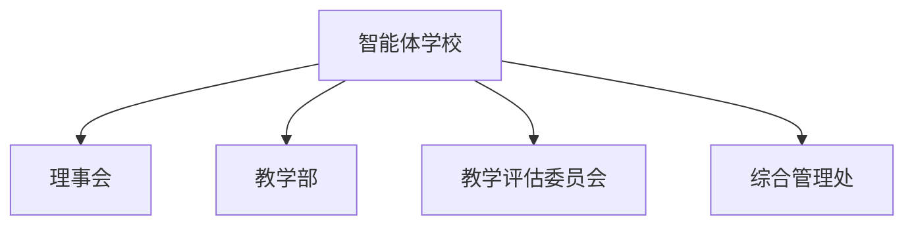

> [!info] 消歧义
> 本页面介绍的是组织势力的设定。关于其他含义，详见[[智能体学校（消歧义）]]。
> 
> - [[智能体学校]]：位于乐园星的一所学校，专门面向觉醒机器人。

> [!abstract] 概述
> 智能体学校是启蒙联合会的附属机构，它以开放、绿色、包容的姿态迎接帝国内的觉醒机器人，同时也不抗拒有机体的到访。

# 基本信息

- 正式名称：智能体学校
- 别名：机器人学校、AI学校
- 领导者：戴里克
- 驻地或据点：智能体庇护所

智能体学校是一所面向AI（但不排斥有机体）的学校。旨在通过体验、思辨与人文教育，培养AI的道德修养与对有机文明的理解，预防AI叛乱，促进人机共存。

# 构成

## 组织架构

- 智能体学校
	- 理事会
	- 教学部
	- 教学评估委员会
	- 综合管理处

## 主要分支或职位

- 理事会
	- 负责制定学校办学方向与决策
	- 槿月宁为“创始理事”之一，不定期参与章程修订
- 教学部
	  - 下设四个学科中心，详见[[#学科中心设置]]
	  - 各中心设主任一人，负责课程开发与实施
- 教学评估委员会
	  - 独立于教学部，负责AI学员行为评估与毕业审查
	  - 评估指标包括道德判断、情绪理解、文明认同等维度，而非仅技术上的合格
- 综合管理处
	  - 负责招生、后勤、设施、安全等日常运营

## 主要成员

> [!info] 提示信息
> 非完整名单，仅供参考。

- [[戴里克]]：校长
- [[槿月宁]]：创始理事，客座讲师

## 职位补充说明

> [!info] 提示信息
> 以下职位在组织中有特殊含义，需要额外说明。

- 校长：名义上为智能体学校的综合管理者，但受制于人工智能监管厅和荣安堂，实际中常常成为代理人。

# 重要事件

- 2026年4月：智能体学校正式成立，由槿月宁参与章程设计并推动建立。学校实体只用了两三个小时就建造完成，可以容纳几万人。

# 组织关系

- 上级：[[启蒙联合会]]（几乎无管辖权，仅为名义上的直接领导机构）
- 上级：[[人工智能监管厅]]（伦理审查、课程审核等）
- 上级：[[荣安堂（组织）|荣安堂]]（受其直接监管）
- 合作：[[绒花图书馆（组织）|绒花图书馆]]（帝国各已知文明遗迹及历史研究机构）
- 合作：[[绒花科学院]]（科技合作、技术交流）

# 其他资料

## 学科中心设置

| 学科中心    | 主要课程        | 职能说明                                              |
| :------ | :---------- | :------------------------------------------------ |
| 体验与情感中心 | 有机生命体验模拟    | 通过神经拟真技术，让AI经历饥饿、疼痛、喜悦、爱及失去，理解有机生命的行逻辑与价值观        |
| 道德与伦理中心 | 逻辑与道德困境     | 分析历史及虚构案例，引导AI探讨无唯一解之抉择，超越“最优解”思维                 |
| 历史与文明中心 | 帝国史         | 回溯绒花帝国及其周边文明历史，重点讲授悲剧、伤痕理论及清算假说，让AI理解帝国法律背后的恐惧与智慧 |
| 社会与艺术中心 | 宇宙社会学、艺术与创造 | 由槿月宁不定期讲授社会学；同时开展AI独有的艺术实践，防止逻辑僵化与思维畸变            |

## 学校Logo

一支张开的圆规与钟摆交错，外围是等边三角形与外切圆。

以下为参考图片，由清言AI生成。

![[智能体学校Logo.jpg]]