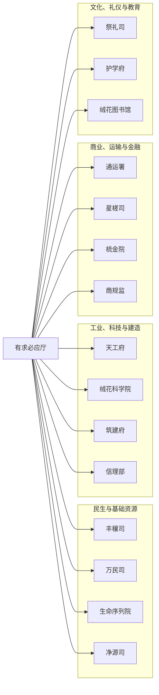

> [!abstract] 概述
> 绒花帝国星之廷五大核心部门之一，历史悠久，负责公共服务对接、行业统一管理与宗教事务执行，并下辖多个民生、基建、商业及文化领域的分支机构。

# 基本信息

- 正式名称：有求必应厅
- 别名：无
- 领导者：初云
- 驻地或据点：绒花宫

在某些早期历史语境中，可被“绒花宫”一词代指。

有求必应厅是[[星之廷]]的组成部分，组织架构为**垂直管理**模式。其对下辖的各分支部门拥有巨大的**执行权**与**协调权**，但**决策权**受到[[紫枢院]]的协调和帝国法典的约束。部门的重大指令最终需通过紫枢院禀报圣君，进行“合规性核查”。

其运作受到[[荣安堂（组织）|荣安堂]]的全面监督，荣安堂有权调查其内部的任何违规行为。

# 构成

## 组织架构

- 有求必应厅
	- 祭礼司
	- 护学府
	- 绒花图书馆
	- 通运署
	- 星槎司
	- 梳金院
	- 商规监
	- 天工府
	- 绒花科学院
	- 筑建府
	- 信理部
	- 丰穰司
	- 万民司
	- 生命序列院
	- 净源司

## 主要分支或职位

- 有求必应厅：最高决策层与协调管理团队。最高控制者称为“圣言使”。
	- 文化、礼仪与教育
		- 祭礼司：由原神殿人员分化而来，现主要负责接待外宾、举办庆典活动等皇家礼仪。
		- 护学府：主管教育领域，负责教育人员的考核提拔，监管教学质量，并为更高阶机构输送人才。
		- 绒花图书馆：储备高级人才，负责修史、起草诏书，并掌控音像出版事务。
	- 商业、运输与金融
		- 通运署：总管所有交通网络，包括星际、空地航线及城内交通，并负责民用飞船的审批与监管。
		- 星槎司：负责恒星际与行星际航运、飞船制造监管、太空港运营及外星殖民地联络。
		- 梳金院：负责信用体系管理、国家预算编制、跨部门结算和生产计划的制订。
		- 商规监：监督有限的市场经济活动，打击黑市，执行交易管控。
	- 工业、科技与建造
		- 天工府：总管重工业、精密制造业、能源生产和战略资源开采。
		- 绒花科学院：管理帝国所有科学事务、科技审批与调控，并负责培养科技骨干。
		- 筑建府：负责所有基础设施、城市扩建、太空设施等的建造与维护。
		- 信理部：负责信息网络、数据海、国内通信与超级计算中心的运行与安全。
	- 民生与基础资源
		- 丰穰司：负责农业规划、太空农场管理、基因作物管控、食品分配与供应链监管。
		- 万民司：负责户籍管理、基本社会福利分配、公共住房、非紧急物资配给。其核心职员与职能承接自有求必应厅的旧有部门。
		- 生命序列院：负责医药研发、基因编辑审批、公共卫生与传染病防控。
		- 净源司：负责水、空气等基本元素的净化、循环与管理，并拥有一定的星球改造权限。

## 主要成员

> [!info] 提示信息
> 非完整名单，仅供参考。

- [[初云]]：圣言使

## 职位补充说明

> [!info] 提示信息
> 以下职位在组织中有特殊含义，需要额外说明。

- 圣言使：有求必应厅的最高控制者，对圣座负责。该职位是协调各部门的关键，往往需要克服诸方阻力促进具体业务的落实。

# 重要事件

- 2024年6月1日：有求必应厅依然是主要的管理部门，糅合了许多职能，随着帝国规模扩大，变得臃肿不堪。
- 2025年8月21日：行政体系改革。其规模被大幅削减，原有的土地、户口、赋税、财政等核心权力被剥离或转交。其中，最重要的民生服务职能划转给新设的万民司，标志着其从一个全能型中央管理部门，转变为一个更侧重于公共服务统筹和宗教事务执行的专门机构。

# 组织关系

- 上级：[[星之廷]]（对圣座负责）
- 平级：
    - [[紫枢院]]（关系紧密，日常工作指令由紫枢院分解传达）
    - [[圣卫军]]（构成文武分治的权力制衡）
    - [[荣安堂（组织）|荣安堂]]（构成文武分治的权力制衡，常有法律方面的联动合作）
    - [[明镜军]]（互不隶属，但处于其潜在的威慑之下）
- 下级：
	- [[祭礼司]]
	- [[护学府]]
	- [[绒花图书馆（组织）|绒花图书馆]]
	- [[通运署]]
	- [[星槎司]]
	- [[梳金院]]
	- [[商规监]]
	- [[天工府]]
	- [[绒花科学院]]
	- [[筑建府]]
	- [[信理部]]
	- [[丰穰司]]
	- [[万民司]]
	- [[生命序列院]]
	- [[净源司]]
- 特殊关系：
    - 是宗教组织[[花之教廷]]的**上级管理机构**，拥有对其的监管与约束权限。

# 其他资料

- 该部门在神殿时期就已存在，是帝国历史最悠久的部门之一，其名称“有求必应”也体现了其早期作为与民众对接的公共服务窗口的职能。
- 作为星之廷的核心部门之一，其在绒花帝国国旗五芒星上占据一角，是足以撼动朝野的强大力量。