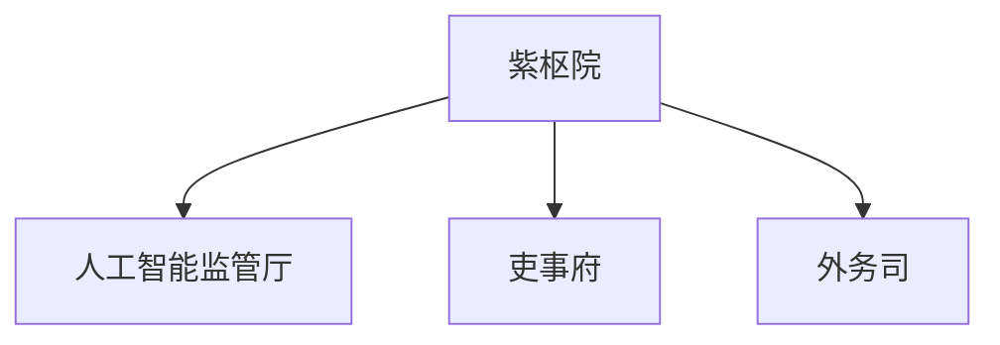

> [!abstract] 概述
> 绒花帝国唯一受圣君认可的内阁机构，直接对风灵负责，作为君主意志的分解者与跨部门事务的协调者，本身不具备独立的决策权。

# 基本信息

- 正式名称：紫枢院
- 别名：宫廷内阁
- 领导者：初云
- 驻地或据点：绒花宫

紫枢院是[[星之廷]]的组成部分，但其内部结构精简，并非一个庞大的执行机构。其核心功能是作为君主[[风灵]]的**高级秘书处与协调会**。它接收君主的指令或帝国法典框架下的任务，将其分解为可执行的方案，转发给各执行部门（如[[有求必应厅]]、[[天工府]]等），并协调这些部门之间的合作。紫枢院本身不直接参与社会治理或生产建设。

# 构成

## 组织架构

- 紫枢院
	- 人工智能监管厅
	- 吏事府
	- 外务司

## 主要分支或职位

- 紫枢院
	- 人工智能监管厅：虽隶属于紫枢院，但其职能具有特殊性。它依照风灵留下的律令，负责监督帝国所有AI的开发与应用，权力极大，但自身也受到最严格的约束，体现了风灵对尖端科技直接掌控的意图。
	- 吏事府：紫枢院下设的核心权力部门之一，拥有对**紫枢院自身附属机构**及[[有求必应厅]]所有附属机构官员的**考核与监管权**。这是紫枢院对庞大官僚系统施加影响的关键渠道。
	- 外务司：绒花帝国的外交事务中心，常常与[[祭礼司]]配合行动。参与外交对话、外交谈判、边境管理等。

## 主要成员

> [!info] 提示信息
> 非完整名单，仅供参考。

- [[初云]]：圣堂监护

## 职位补充说明

> [!info] 提示信息
> 以下职位在组织中有特殊含义，需要额外说明。

- 圣堂监护：紫枢院的最高负责人。此职位直接听命于圣君，负责主持紫枢院的日常运作，将君主意志传达到帝国各处。

# 重要事件

# 组织关系

- 上级：[[星之廷]]（风灵拥有对紫枢院一切决议的最终否决权，并可随时绕过紫枢院直接下达圣旨）
- 平级：
    - [[有求必应厅]]（关系极为紧密，并通过吏事府对有求必应厅拥有人事上的影响力）
    - [[圣卫军]]（构成文武分治的权力制衡）
    - [[荣安堂]]（构成文武分治的权力制衡）
    - [[明镜军]]（互不隶属，但其传达的君主指令，明镜军理论上也需遵守）
- 下级：
    - [[人工智能监管厅]]
    - [[吏事府]]
    - [[外务司]]

# 其他资料

- 暮雨曾被邀请加入紫枢院，但他考虑到人事回避与权力制衡，最终拒绝了邀请，选择专注于军事与安全领域。这一事件标志着帝国文武两大权力路线的早期分离。
- 名称由来：“紫”源于古典中的“紫宸”，象征尊贵与星象；“枢”意为枢纽、核心，暗示其作为整个帝国官僚系统运转协调中心的功能。
- 存在目的：紫枢院很大程度上是风灵为了从繁琐的日常政务中脱身而设立的“打工机构”。为了防止权力被架空，风灵后续通过多种“补丁”加强了对紫枢院的管控，确保其永远处于自己的绝对控制之下。