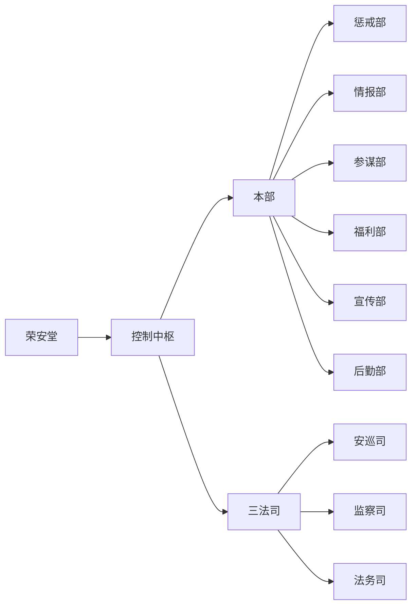

> [!info] 消歧义
> 本页面介绍的是组织势力的设定。关于其他含义，详见[[荣安堂（消歧义）]]。
> 
> - [[荣安堂]]：位于神殿大街西侧的建筑，荣安堂总部。

> [!abstract] 概述
> 荣安堂几乎是绒花帝国中最强力也最冷酷的机构，以情报能力著称。荣安堂干员们或明或暗地与各方势力博弈，执行控制中枢的任务。

# 基本信息

- 正式名称：荣安堂
- 别名：无
- 领导者：暮雨
- 驻地或据点：荣安堂（风神城总部）

荣安堂是[[绒花帝国]]的安全与监察机构，[[星之廷]]成员。下辖三法司（[[安巡司]]、[[监察司]]、[[法务司]]），总管全国情报、安全、监管、审查、司法、治安等工作。在地方上设立办事处，兼顾消防、森林保护、资质审查、工厂维护等工作。

荣安堂起源于[[圣卫军]]，早期骨干成员多由军方转职而来，保留了强大的的侦察与战斗装备。从圣卫军分出独立后，凭借谍报与特种作战方面的优势，履历奇功，成为绒花帝国重要的国家安全力量。后成为星之廷的一员，掌管法务大权，制衡百官。

荣安堂中负责执行各种任务的人员被称为“干员”。

# 构成

## 组织架构

- 荣安堂
	- 控制中枢
	- 本部
		- 惩戒部
		- 情报部
		- 参谋部
		- 福利部
		- 宣传部
		- 后勤部
	- 三法司
		- 安巡司
		- 监察司
		- 法务司

## 主要分支或职位

- 控制中枢：荣安堂的最高决策层，通常只有精英干员才有资格加入。
	- 本部：荣安堂的核心执行机构，统管日常事务。本部所辖各部门为控制中枢直接控制，列出”本部“仅是习惯意义上的区分。
		- 惩戒部
		- 情报部
		- 参谋部
		- 福利部
		- 宣传部
		- 后勤部
	- 三法司：监督及执法机构，独立于本部运行。原属于宫廷，现受荣安堂管辖。三法司皆由控制中枢直接管辖。
		- 安巡司
		- 监察司
		- 法务司

## 主要成员

> [!info] 提示信息
> 非完整名单，仅供参考。

- [[暮雨]]：鉴书
- [[凯洛兰·瓦卢瓦]]：总指挥（控制中枢），惩戒部部长（惩戒部）
- [[钟永明]]：副指挥（控制中枢），情报部部长（情报部）
- [[郑安]]：职位未知，荣安堂精英干员
- [[王巧如]]：福利部部长（福利部）

## 职位补充说明

> [!info] 提示信息
> 以下职位在组织中有特殊含义，需要额外说明。

- 鉴书：荣安堂的最高领导者，权限在控制中枢之上。控制中枢需要鉴书授权才能在权限范围内自主策划行动，本质上是鉴书的代理人。

>他们将在很大程度上代理荣安堂内部事务 ——安排作战行动，经营情报网络，监控重要区域，审理重大案件。
>
>——《莲生玉宇》第二十二章

# 重要事件

- 2024年：荣安堂尚未与圣卫军彻底分离，主要负责情报收集和分析工作，同时作为特种作战单位执行某些特别行动。
- 2025年：绒花帝国政府职能部门细化分化，星之廷体系落地。荣安堂作为星之廷的其中一角而存在。
- 2026年1月1日：
	- 来自明镜军的三名观察员正式进驻荣安堂。观察员只听从圣君的命令，负责监管荣安堂的运行，对各项决议和行动进行记录备案，其他事项则遵循明镜军的管理规则。
	- 通常情况下，观察员除了监听、调查、记录外，不会进行额外操作。但他们可以随时根据圣君的命令，强行制止或强制执行荣安堂的某些操作。观察员有权进入荣安堂设施内部的所有场所，访问所有存储文件，向任何人提问。荣安堂不得以任何方式阻碍观察员的行动。
	- 观察员是由圣君直接选定的，并且随时可以被调换。
- 2026年3月：扩编情报部。
- 2026年5月29日：暮雨接收到报告，荣安堂已正式组建了名为“控制中枢”的核心指挥团队。

# 组织关系

- 上级：[[星之廷]]（对圣座负责）
- 平级：
	- [[圣卫军]]（早期成员来自于此，现仍有密切合作）
	- [[有求必应厅（组织）|有求必应厅]]（密切工作事务往来，大多数成员私下都很熟络）
	- [[紫枢院]]（法律方面交流，互相监督）
	- [[明镜军]]（名义上为平级，但荣安堂内有圣座指派的明镜军观察员，负责监督荣安堂的运行）
- 下级：
	- [[安巡司]]（治安与执法）
	- [[监察司]]（监察政府部门、官员、权贵）
	- [[法务司]]（司法与审判）

# 其他资料

## 精英干员列表

本列表整理了已知的荣安堂精英干员。列表中，所属部门仅取其最高职位。暮雨**不是**荣安堂干员，目前的公开信息中他从未以干员自称。

| 名称      | 最高职位 | 所属部门 | 备注   |
| ------- | ---- | ---- | ---- |
| 凯洛兰·瓦卢瓦 | 总指挥  | 控制中枢 |      |
| 钟永明     | 副指挥  | 控制中枢 |      |
| 郑安      |      |      | 职位未知 |